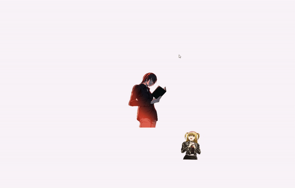

<h4 align=center>Ninad Moharir<h4>
<h1 align=center>Project 1: <em>Simple 2D Scene</em></h1>
<h3 align=center><em>(for Intro to Game Programming)</em></h3>

This repo contains a scene with Light and Misa in OpenGL. It involves relative translation, rotation, and scaling. The result:

